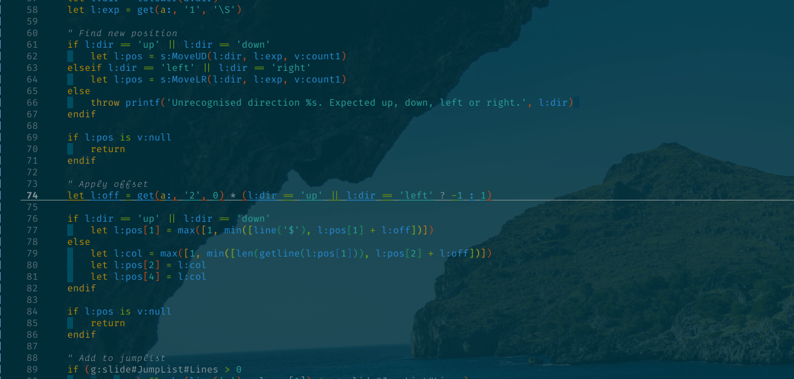

# vim-slide

This provides a set of unidirectional whitespace-boundary motions.

**Example**

The following was recorded using default options:

>  vim: set ts=4 sw=4 tw=0 fdm=manual fenc=utf-8 et :
